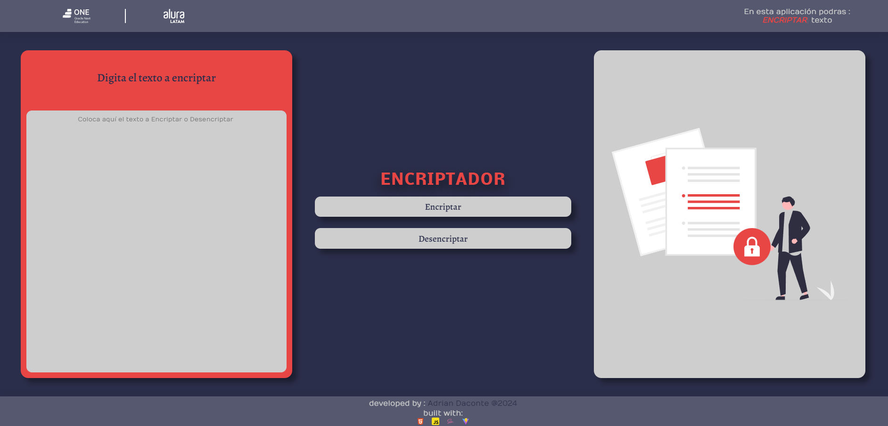

<h1 align="center">Encriptador de Texto</h1>

  Este es un proyecto elaborado para el reto propuesto en el curso de Alura Latam y el programa Next One Generation. Cuenta con un diseño responsivo para cualquier dispositivo. Utilizamos Vite para optimizar el desarrollo y la construcción del proyecto.

  
  

<h4 align="center">
👷 PROYECTO EN CONSTRUCCIÓN 👷
</h4>

## 📑 Índice
- [Desplegado en Vercel](#-desplegado-en-vercel)
- [Lógica del Encriptador](#-lógica-del-encriptador)
- [Restricciones](#️-restricciones)
- [Funcionalidades](#-funcionalidades)
- [Cómo Funciona](#-cómo-funciona)
- [Tecnologías](#-tecnologías)
- [Librerías Utilizadas](#-librerías-utilizadas)

## 🌐 Desplegado en Vercel

  Puedes acceder al proyecto desplegado en Vercel en la siguiente dirección:  
  <a href="https://challenge-alura-encriptador-jet.vercel.app/">https://challenge-alura-encriptador-jet.vercel.app/</a>

## 🔍 Lógica del Encriptador
- La letra **"e"** es convertida a **"enter"**
- La letra **"i"** es convertida a **"imes"**
- La letra **"a"** es convertida a **"ai"**
- La letra **"o"** es convertida a **"ober"**
- La letra **"u"** es convertida a **"ufat"**

## ⚠️ Restricciones
- Debe funcionar solo con letras minúsculas.
- No deben ser utilizadas letras con acentos ni caracteres especiales.

---

## ✨ Funcionalidades
- 📌 Cuenta con un popup de advertencia cuando el texto tiene una restricción mencionada arriba.
- 🔒 Botón de encriptar.
- 🔓 Botón de desencriptar.
- 🎨 Animaciones en header y contenedor de salida.

---

## Cómo Funciona❓ 
Se cuenta con un input para ingresar el texto que se quiere encriptar o desencriptar. Al presionar el botón correspondiente, se genera en un contenedor de salida el resultado deseado.

---

## 🛠️ Tecnologías

  
  
  
  
  

---

## 📚 Librerías Utilizadas
- [Typed.js](https://github.com/mattboldt/typed.js/)

---

  
  

<h4 align="center">
👷 PROYECTO EN CONSTRUCCIÓN 👷
</h4>